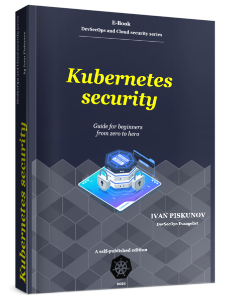

# Kubernetes security. Guide for beginners from zero to hero [e-book]
_DevSecOps and Cloud security series. E-book, self-published edition by Ivan Piskunov_

                                                         

## About the book
In this comprehensive e-book, we’re going to deep dive into the Kubernetes security. This book addressed for everyone system engineers and security expert who involved in developer’s software process based on microservices architecture and cloud infrastructure.

From this book you will find an overview of attack surface, an analysis of main cyber risks and potential system flaw in cluster, as well as several scenarios with different attack vectors and demonstration cases of successful attacker penetration inside. A separate chapter in the book will be devoted to preparing for the Certified Kubernetes Security Specialist (CKS), which provides tips, resources, and practical tasks that will be on the exam.

## About the author
Ivan Piskunov, cybersecurity expert who have got more than 10 years of industry experience. Ivan has a Master's degree in Computer Science in cybersecurity. Multiple speaker of various public security events, author and lecturer of training courses on Linux security and technical audit of IT infrastructure. Currently holds the position of DevSecOps in a software development company.

**You can read some of the author's other materials here:**
* [HackMag e-zine](https://hackmag.com/author/g14vano/)
* [CyberSecBastion](https://t.me/CyberSecBastion)

## Feedback

# Resources list
